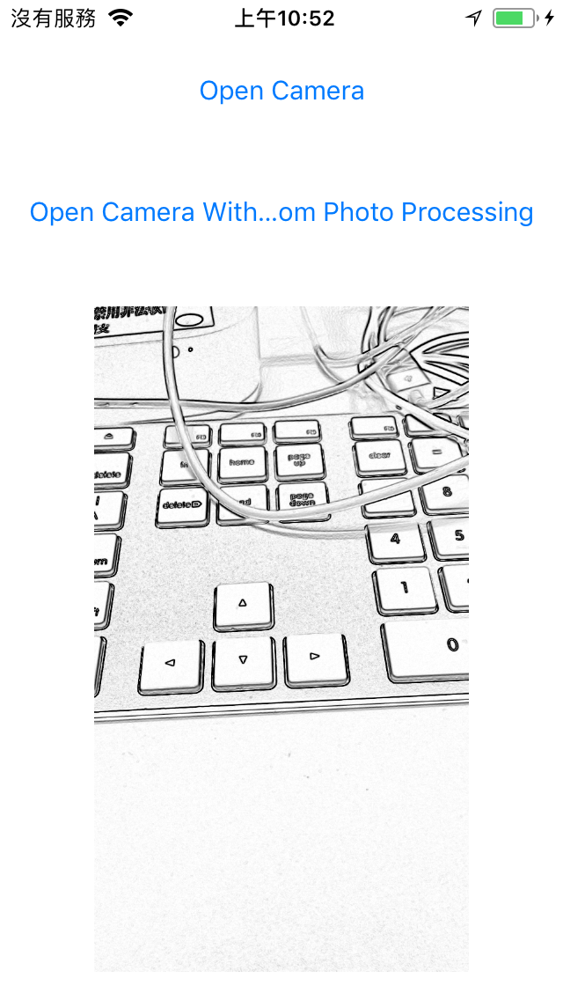

# IRCameraViewController 

- IRCameraViewController is a powerful camera view controller for iOS.

## Features
- Completely custom camera with AVFoundation
- Custom view with camera permission denied
- Custom button colors
- Easy way to access album (camera roll)
- Flash auto, off and on
- Focus
- Front and back camera
- Grid view
- Preview photo view with three filters (fast processing)
- Visual effects like Instagram iOS app
- Custom image filters

## Install
### Git
- Git clone this project.
- Copy this project into your own project.
- Add the .xcodeproj into you  project and link it as embed framework.
#### Options
- You can remove the `ScreenShots` folder.

### Cocoapods
- Not support yet.

## Usage

### Basic

#### Take photo


```obj-c
#import "IRCameraViewController.h"

@interface IRViewController : UIViewController <IRCameraDelegate>

@property (strong, nonatomic) IBOutlet UIImageView *photoView;

- (IBAction)takePhotoTapped;

@end


@implementation IRViewController

- (IBAction)takePhotoTapped
{
    IRCameraNavigationController *navigationController =
    [IRCameraNavigationController newWithCameraDelegate:self];

    [self presentViewController:navigationController animated:YES completion:nil];
}

#pragma mark - IRCameraDelegate optional

- (void)cameraWillTakePhoto
{
    NSLog(@"%s", __PRETTY_FUNCTION__);
}

- (void)cameraDidSavePhotoAtPath:(NSURL *)assetURL
{
    // When this method is implemented, an image will be saved on the user's device
    NSLog(@"%s album path: %@", __PRETTY_FUNCTION__, assetURL);
}

- (void)cameraDidSavePhotoWithError:(NSError *)error
{
    NSLog(@"%s error: %@", __PRETTY_FUNCTION__, error);
}

#pragma mark - IRCameraDelegate required

- (void)cameraDidCancel
{
    [self dismissViewControllerAnimated:YES completion:nil];
}

- (void)cameraDidTakePhoto:(UIImage *)image
{
    _photoView.image = image;
    [self dismissViewControllerAnimated:YES completion:nil];
}

- (void)cameraDidSelectAlbumPhoto:(UIImage *)image
{
    _photoView.image = image;
    [self dismissViewControllerAnimated:YES completion:nil];
}

@end
```

#### Choose photo

```obj-c
#import "IRCameraViewController.h"

@interface IRViewController : UIViewController
<UINavigationControllerDelegate, UIImagePickerControllerDelegate>

@property (strong, nonatomic) IBOutlet UIImageView *photoView;

- (IBAction)chooseExistingPhotoTapped;

@end


@implementation IRViewController

- (IBAction)chooseExistingPhotoTapped
{
    UIImagePickerController *pickerController =
    [IRAlbum imagePickerControllerWithDelegate:self];

    [self presentViewController:pickerController animated:YES completion:nil];
}

#pragma mark - UIImagePickerControllerDelegate

- (void)imagePickerController:(UIImagePickerController *)picker
didFinishPickingMediaWithInfo:(NSDictionary *)info
{
    _photoView.image = [IRAlbum imageWithMediaInfo:info];
    [self dismissViewControllerAnimated:YES completion:nil];
}

- (void)imagePickerControllerDidCancel:(UIImagePickerController *)picker
{
    [self dismissViewControllerAnimated:YES completion:nil];
}

@end
```

#### Change colors

```obj-c
@implementation IRViewController

- (void)viewDidLoad
{
    [super viewDidLoad];
    
    UIColor *tintColor = [UIColor greenColor];
    [IRCameraColor setTintColor:tintColor];
}

@end
```

#### Options

|Option|Type|Default|Description|
|:-:|:-:|:-:|:-:|
|kIRCameraOptionHiddenToggleButton|NSNumber (YES/NO)|NO|Displays or hides the button that switches between the front and rear camera|
|kIRCameraOptionHiddenAlbumButton|NSNumber (YES/NO)|NO|Displays or hides the button that allows the user to select a photo from their album|
|kIRCameraOptionHiddenFilterButton|NSNumber (YES/NO)|NO|Displays or hides the button that allos the user to filter their photo|
|kIRCameraOptionSaveImageToAlbum|NSNumber (YES/NO)|NO|Save or not the photo in the camera roll|
|kIRCameraOptionUseOriginalAspect|NSNumber (YES/NO)|NO|Use the original aspect instead of cropping the image to a square|

```obj-c
#import "IRCamera.h"

@implementation UIViewController

- (void)viewDidLoad
{
    //...
    [IRCamera setOption:kIRCameraOptionHiddenToggleButton value:@YES];
    [IRCamera setOption:kIRCameraOptionHiddenAlbumButton value:@YES];
    [IRCamera setOption:kIRCameraOptionHiddenFilterButton value:@YES];
    [IRCamera setOption:kIRCameraOptionSaveImageToAlbum value:@YES];
    //...
}

- (IBAction)buttonTapped
{
    //...
    BOOL hiddenToggleButton = [[IRCamera getOption:kIRCameraOptionHiddenToggleButton] boolValue];
    BOOL hiddenAlbumButton = [[IRCamera getOption:kIRCameraOptionHiddenAlbumButton] boolValue];
    BOOL hiddenFilterButton = [[IRCamera getOption:kIRCameraOptionHiddenFilterButton] boolValue];
    BOOL saveToDevice = [[IRCamera getOption:kIRCameraOptionSaveImageToAlbum] boolValue];
    //...    
}

@end
```

### Advanced settings

Custom image filters(You can see how GPUImage work in the demo project):

- Return `YES` by `customizePhotoProcessingView` in the `IRCameraDelegate` to disable the default filters
```obj-c

#pragma mark - IRCameraDelegate

- (BOOL)customizePhotoProcessingView {
    return YES;
}

```

- Deal with the image by your own way:
```obj-c

#import <GPUImage/GPUImage.h>

- (UIImage *)imageWithSketchFilter:(UIImage *)originImage {
    GPUImageFilter *imageFilter = [[GPUImageSketchFilter alloc] init];
    return [imageFilter imageByFilteringImage:originImage];
}

```

## Screenshots
| Demo Main Page | Camera |
|:---:|:---:|
||| 
| Camera with Grid View | Confirm |
||| 
| Default filters | Album |
||| 
| Custom filters | Update display view |
||| 

## Copyright
##### This project is inspired from [TGCameraViewController](https://github.com/tdginternet/TGCameraViewController).
